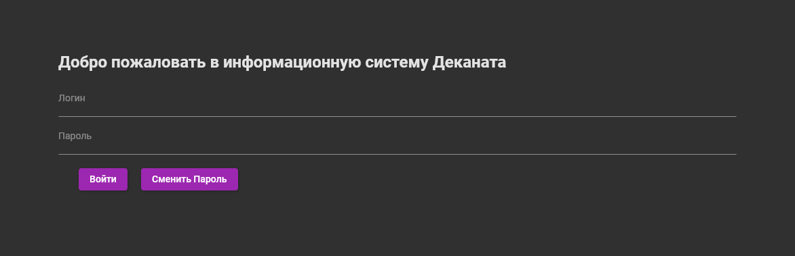
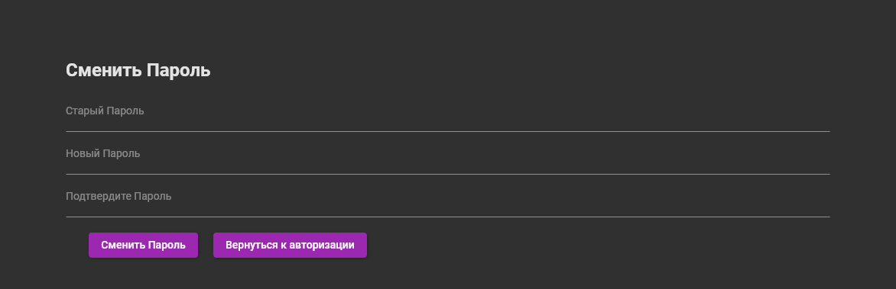
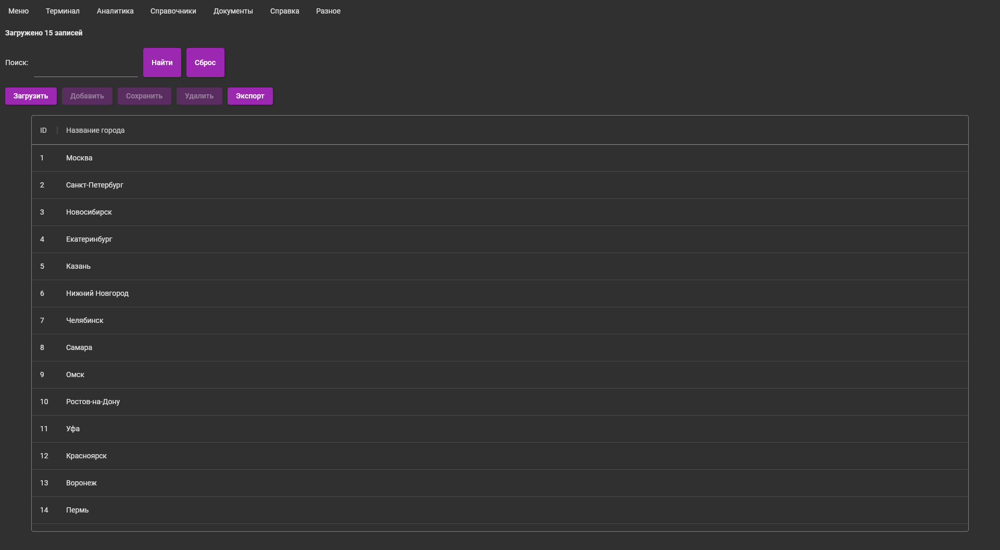
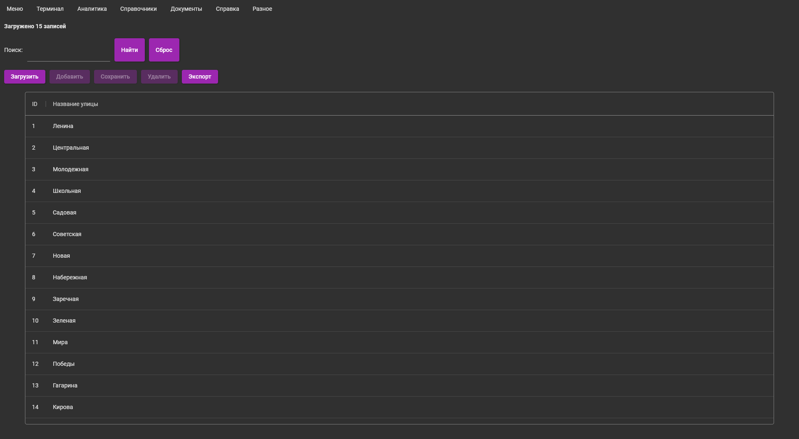
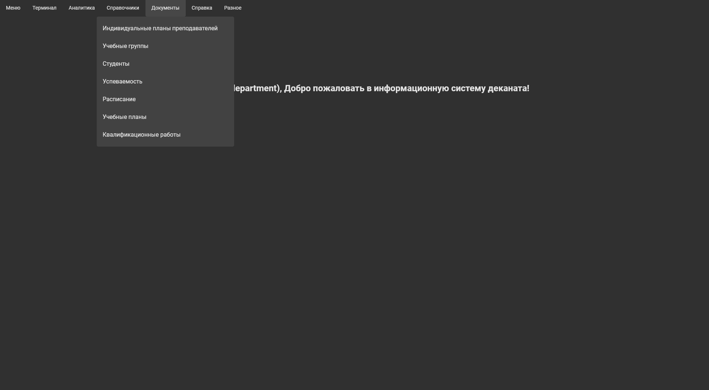
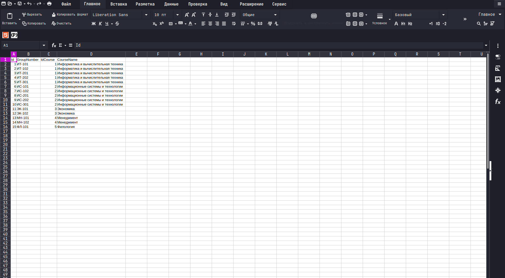
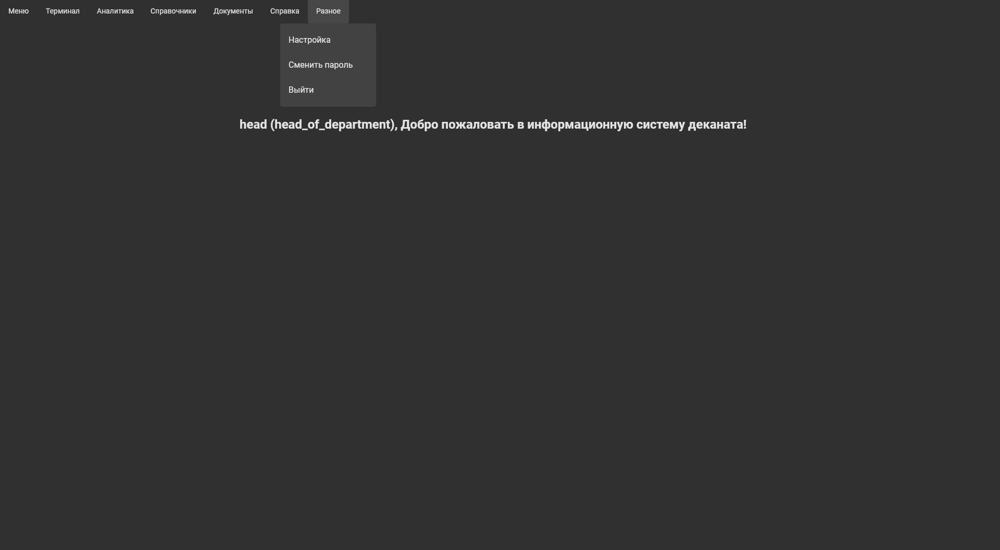
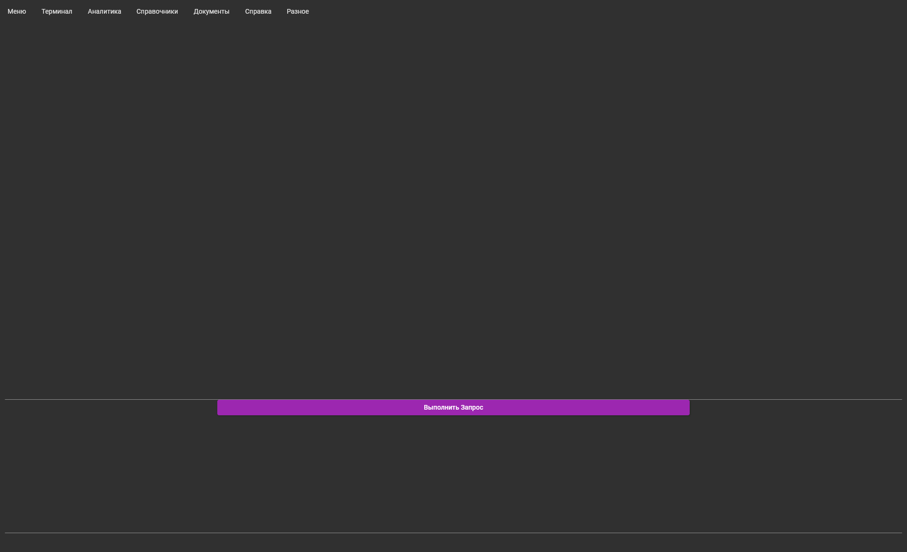
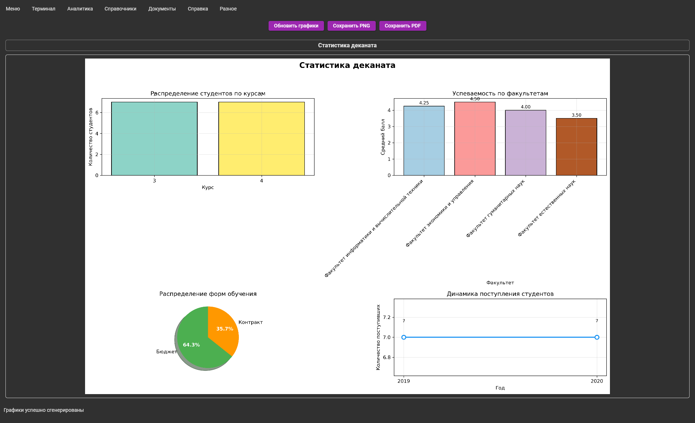

# Руководство пользователя информационной системы деканата

## Оглавление
1. [Аутентификация](#аутентификация)
2. [Смена пароля](#смена-пароля)
3. [Навигация в приложении](#навигация-в-приложении)
4. [Пункт "Справочники"](#пункт-справочники)
5. [Пункт "Документы"](#пункт-документы)
6. [Работа с таблицами](#работа-с-таблицами)
7. [Пункт "Разное"](#пункт-разное)
8. [Пункт "Терминал"](#пункт-терминал)
9. [Пункт "Главное меню"](#пункт-главное-меню)
10. [Пункт "Аналитика"](#пункт-аналитика)
11. [Пункт "Справка"](#пункт-справка)

## Аутентификация
При запуске системы открывается окно аутентификации. Для входа необходимо:
1. Выбрать роль пользователя из выпадающего списка
2. Ввести логин
3. Ввести пароль
4. Нажать кнопку "Войти"

*Примечание: доступные роли зависят от ваших учетных данных в системе.*

## Смена пароля
Сменить пароль можно двумя способами:
1. Из пункта меню "Разное" → "Сменить Пароль" ИЛИ в меню аунтефикации нажать на "Сменить Пароль"
2. При первой авторизации, если система требует смены пароля

Для смены пароля необходимо:
1. Ввести текущий пароль
2. Ввести новый пароль (дважды для подтверждения)
3. Нажать кнопку "Сменить Пароль"

## Навигация в приложении
После успешной аутентификации открывается главное окно приложения с навигационным меню. Структура меню зависит от роли пользователя:

Навигационное меню содержит следующие пункты (доступность зависит от роли):
- Главное меню
- Терминал
- Аналитика
- Справочники
- Документы (для вашей роли)
- Справка
- Разное

## Пункт "Справочники"
Раздел "Справочники" содержит общие справочные таблицы, доступные всем пользователям.

### Таблица "Города"

Функционал:
- Просмотр списка городов
- Поиск по названию города
- Сортировка по столбцам

### Таблица "Улицы"

Функционал:
- Просмотр списка улиц
- Поиск по названию улицы
- Сортировка по столбцам

## Пункт "Документы"
Раздел "Документы" содержит таблицы, специфичные для вашей роли пользователя. Содержимое этого раздела зависит от назначенных прав доступа.

Пример для роли "Заведующий кафедрой":

Возможные документы по ролям:
- **Декан**: факультетские приказы, отчеты по успеваемости
- **Методист**: учебные планы, расписание занятий
- **Зав. кафедрой**: кадровые документы, отчетность кафедры
- **Преподаватель**: журналы успеваемости, индивидуальные планы
- **Ученый секретарь**: протоколы заседаний, отчеты
- **Администратор**: все документы системы

## Работа с таблицами
При работе с любой таблицей в системе доступны следующие функции:

### Основные операции
1. **Добавление записи** - кнопка "Добавить" открывает форму для ввода данных
2. **Редактирование записи** - двойной щелчок по строке или кнопка "Изменить"
3. **Удаление записи** - кнопка "Удалить" с подтверждением
4. **Поиск** - поле поиска с фильтрацией по всем столбцам
5. **Сортировка** - щелчок по заголовку столбца для сортировки по возрастанию/убыванию

### Экспорт в CSV
Для экспорта данных в формат CSV:
1. Нажмите кнопку "Экспорт" в верхней части таблицы
2. Выберите "Экспорт в CSV"
3. Укажите место сохранения файла
4. Нажмите "Сохранить"

*Примечание: экспортируются все данные таблицы с учетом текущих фильтров и сортировки.*

## Пункт "Разное"
Раздел "Разное" содержит служебные функции:

### Настройка

Возможности:
- Изменение темы оформления (светлая/темная)
- Настройка размера шрифта
- Языковые настройки
- Параметры отображения таблиц

### Сменить пароль
Дублирует функцию смены пароля, описанную выше.

### Выйти
Завершает текущую сессию пользователя и возвращает к окну аутентификации.

## Пункт "Терминал"
Терминал позволяет выполнять произвольные SQL-запросы к базе данных в рамках ваших прав доступа.

Функционал терминала:
1. Ввод SQL-запросов в текстовом поле
2. Выполнение запроса (кнопка "Выполнить" или Ctrl+Enter)
3. Просмотр результатов 

*Внимание: все запросы выполняются с правами вашей роли. Изменяющие запросы (INSERT, UPDATE, DELETE) требуют подтверждения.*

## Пункт "Главное меню"
Возвращает к главному экрану вашей роли. Полезно для быстрой навигации, если вы углубились в разделы системы.

## Пункт "Аналитика"
Раздел "Аналитика" предоставляет визуализацию данных в виде графиков и диаграмм.

Доступные отчеты:
- Распределение студентов по курсам
- Успеваемость по факультетам
- Распределение форм обучения
- Динамика поступления

Каждый отчет можно:
1. Фильтровать по периоду, факультету, кафедре
2. Экспортировать в PNG или PDF
3. Настраивать тип графика (столбчатая, круговая, линейная)

## Пункт "Справка"
Раздел "Справка" содержит документацию по использованию системы.

### Руководство пользователя
Открывает данное руководство в формате, удобном для чтения в приложении.

### О программе
Содержит информацию о версии программы, разработчиках и контактные данные.

---

## Поддержка
При возникновении проблем или вопросов:
1. Обратитесь к разделу "Справка" → "Руководство пользователя"
2. Свяжитесь с технической поддержкой вашего учебного заведения

---